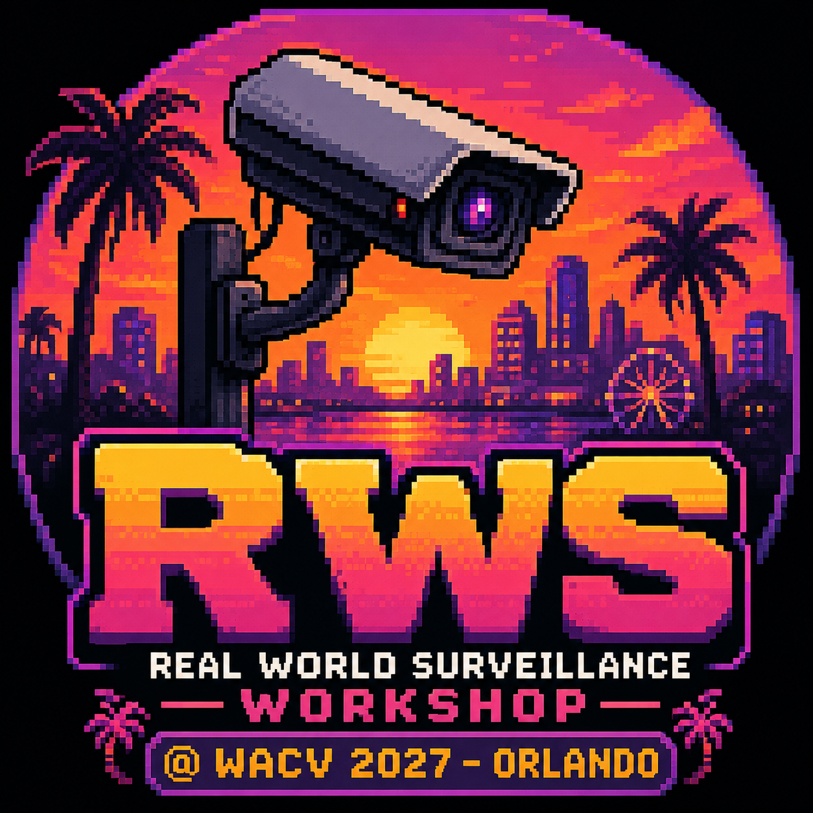

# UPAR 2027 Challenge Track 3 Development Data @ Real-World Surveillance Workshop 2027

<a href="https://pytorch.org/get-started/locally/"></a>

Official starter kit for **Track 3: 2D Human Pose Estimation** of the UPAR Challenge at
the Real-World Surveillance workshop (RWS), WACV 2027.

<div style="text-align: center;">

</div>

The challenge task is top-down 2D human pose estimation under domain shift:
for every provided pedestrian box, predict the **17 PoseTrack18 keypoints** in
absolute image coordinates.

## Information

- Associated workshop: [Real-World Surveillance: Applications and Challenges Workshop](https://vap.aau.dk/rws)
- Challenge Track 1: [Pedestrian Attribute Recognition](https://www.codabench.org/competitions/18180/)
- Challenge Track 2: [Attribute-Based Person Retrieval](https://www.codabench.org/competitions/18196/)
- Challenge Track 3: [2D Human Pose Estimation](https://www.codabench.org/competitions/18273/)
- Challenge results 2024 (PAR + ABPR): [UPAR@RWS2024](https://openaccess.thecvf.com/content/WACV2024W/RWS/papers/Cormier_UPAR_Challenge_2024_Pedestrian_Attribute_Recognition_and_Attribute-Based_Person_Retrieval_WACVW_2024_paper.pdf)
- Challenge results 2023 (PAR + ABPR): [UPAR@RWS2023](https://openaccess.thecvf.com/content/WACV2023W/RWS/papers/Cormier_UPAR_Challenge_Pedestrian_Attribute_Recognition_and_Attribute-Based_Person_Retrieval_--_WACVW_2023_paper.pdf)
- UPAR dataset paper (PAR + ABPR): [UPAR dataset](https://openaccess.thecvf.com/content/WACV2023/papers/Specker_UPAR_Unified_Pedestrian_Attribute_Recognition_and_Person_Retrieval_WACV_2023_paper.pdf)

## What this repo contains

- `examples/task3/sample_code_submission/`: minimal baseline submission using a mean pose prior
- `examples/task3/vitpose_submission/`: ViTPose-based example submission
- `data/`: expected location for the released Track 3 training and validation data
- `download_datasets.py`: downloads the public datasets and prepares the expected local data layout

## Setup

```bash
conda env create -f environment.yml
conda activate rws-upar-track3
python download_datasets.py --data-dir data
```

`download_datasets.py` downloads the public Track 3 training datasets and
prepares both the images and the annotations under `data/`. Users should run
the script instead of trying to assemble the directory structure manually.

## Repository layout

```text
.
├── data/
│   ├── annotations/
│   │   └── specialization/
│   │       ├── train_market.json
│   │       ├── train_pa100k.json
│   │       ├── train_peta.json
│   │       └── train_upar_all.json
│   ├── market/
│   │   ├── bounding_box_test/
│   │   ├── bounding_box_train/
│   │   └── query/
│   ├── pa100k/
│   │   └── images/
│   └── peta/
│       └── images/
└── examples/
    └── task3/
        └── vitpose_submission/
```

The Track 3 data uses a COCO-style structure. Person boxes are provided and the
submission predicts 17 keypoints for each box. The competition format keeps 17
PoseTrack18 slots for compatibility; the ear slots remain in the format but are
not annotated in the ground truth and are ignored by scoring.

## Example submissions

The repository ships two Track 3 code submissions:

1. `examples/task3/sample_code_submission/`: minimal baseline using a mean pose prior
2. `examples/task3/vitpose_submission/`: ViTPose+ small example for a stronger starting point

To prepare the ViTPose example once on your machine:

```bash
cd examples/task3/vitpose_submission
pip install transformers
python export_model.py
```

This downloads the Hugging Face checkpoint and writes the generated
`vitpose.torchscript` file locally. The large generated weights are intentionally
not committed to git.

When packaging a submission, zip the **contents** of the submission folder so
`run.py` is at the archive root.

## Rules that matter for development

- You submit **code, not predictions**.
- The evaluation container has **no network access**.
- Pre-training on **COCO** and **PoseTrack18** is allowed.
- No other external pretraining data or foundation models are allowed.
- The hidden test images must never be used for training, pseudo-labeling, or
  hyper-parameter tuning.

## Citation

If you use the UPAR data, cite the UPAR papers as well as the relevant
underlying datasets.

```bibtex
@inproceedings{specker2023upar,
  title={UPAR: Unified Pedestrian Attribute Recognition and Person Retrieval},
  author={Specker, Andreas and Cormier, Mickael and Beyerer, Jurgen},
  booktitle={Proceedings of the IEEE/CVF Winter Conference on Applications of Computer Vision},
  year={2023}
}

@inproceedings{cormier2023upar,
  title={UPAR challenge: pedestrian attribute recognition and attribute-based person retrieval-dataset, design, and results},
  author={Cormier, Mickael and Specker, Andreas and Jacques, Julio CS and Florin, Lucas and Metzler, J{\"u}rgen and Moeslund, Thomas B and Nasrollahi, Kamal and Escalera, Sergio and Beyerer, J{\"u}rgen},
  booktitle={2023 IEEE/CVF Winter Conference on Applications of Computer Vision Workshops (WACVW)},
  pages={166--175},
  year={2023},
  organization={IEEE}
}

@inproceedings{cormier2024upar,
  title={Upar challenge 2024: Pedestrian attribute recognition and attribute-based person retrieval-dataset, design, and results},
  author={Cormier, Mickael and Specker, Andreas and Junior, Julio and CS, Jacques and Moritz, Lennart and Metzler, J{\"u}rgen and Moeslund, Thomas B and Nasrollahi, Kamal and Escalera, Sergio and Beyerer, J{\"u}rgen},
  booktitle={Proceedings of the IEEE/CVF Winter Conference on Applications of Computer Vision},
  pages={359--367},
  year={2024}
}
```

## License

This work is licensed under a [Creative Commons Attribution-NonCommercial-ShareAlike 3.0 License](http://creativecommons.org/licenses/by-nc-sa/3.0/de/). The source image datasets retain their respective licenses and usage restrictions.